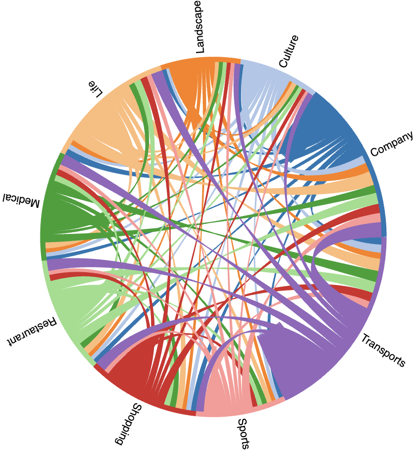

**Background:** Shared bicycles have revolutionized traditional urban transportation, addressing the 'last mile' challenge for commuters. However, the sharing economy's dominance has led to 'tidal patterns' due to human activity cycles, causing supply-demand imbalances and challenges in peak hours. 

**Task**：

1. Urban Activity Patterns Analysis
2. Identification of bike-sharing hotspots 
3. Classification of bike-sharing hotspots 

**Challenge：**

1. **Tidal Patterns and Supply-Demand Imbalances:** The sharing economy's popularity has led to unpredictable usage patterns known as "tidal patterns," where high-demand periods result in supply-demand imbalances. Addressing these fluctuations to ensure a smooth and efficient bike-sharing service during peak hours is a significant challenge.
2. **Data Analysis of Multiple Data Sources:** Integrating diverse data sources such as GPS trajectories, user characteristics, and Point of Interest (POI) data poses a challenge due to differences in data formats, quality, and relevance. Creating a comprehensive analysis that considers various aspects of urban mobility requires careful data integration.
3. **Spatial and Temporal Variability:** Urban mobility patterns can exhibit complex spatial and temporal variations influenced by factors such as weather, events, and so on. Capturing and understanding these variations accurately is essential for designing effective transportation strategies.

**Data source:**

Multisource data including BS order data,  BS trajectories data, BS electric fence data, and POI data were used for subsequent modeling and analysis. The BS order data,  trajectories data, and electric fence data were sourced from the official Digital China Innovation Contest (DCIC 2021) websites. In the realm of BS order data, each record includes bicycle ID, latitude, longitude, lock status, and update time. These records are generated upon user-initiated bicycle pick-up or return, and subsequently transmitted to the server, enabling comprehensive tracking of spatiotemporal activity. The dataset comprises 198,382 journeys occurring during the morning peak hours (6:00–10:00) on five consecutive weekdays from December 21 to 25, 2020. Despite the winter timeframe, the local average maximum temperature stands at around 20°C, providing favorable conditions for cycling activities.

The POI data used in this study was sourced from Amap (https://www.amap.com), a popular mapping and navigation service in China, like Google Maps. Previous research has demonstrated that POI data has numerous applications in urban land use classification and travel purpose recognition. Therefore, combining POI data with human mobility data can provide a better understanding of daily activity patterns. Using Amap's API, approximately 3,428 POI data points were obtained within Xiamen Island. Each POI data point includes information such as name, type, longitude and latitude, and the corresponding region. To explore daily activity patterns and travel purposes, the POI data was categorized into 9 categories, including 'Transports', 'Shopping', 'Culture', 'Sports', 'Life', 'Landscape', 'Restaurant', 'Medical', 'Entrepreneur'.

**Task1:** Urban Activity Patterns Analysis

First, we processed all shared bicycle order data into OD data(O means origin, D means destination), and then visualized it. The trajectories are colored based on the data count, indicating the intensity of bike travel between different origin-destination pairs.

*Figure1: BS trajectories Map* 

Fig.2(a) presents a bar chart that illustrates the daily order counts over the span of five days. Notably, there was a significant decrease in daily order counts on the 23rd of December. This decline can be attributed to the presence of moderate rainfall, which rendered cycling less favorable. Consequently, the subsequent analysis will focus solely on the OD data from the remaining four weekdays. The highest volume of orders was recorded from 08:00 to 08:15, as depicted in Fig.2(b). Further examining transportation patterns, Fig.2(c) reveals that approximately 75% of the travel distances using the BS mode are limited to within 1,000 meters. This outcome underscores the role of BS as a primary mode of transportation for covering the first or last mile of journeys. Moreover, Figure 2(d) displays the distribution of trip durations. While certain trips extend beyond 20 minutes, the majority (75%) of trip durations fall within the 10-minute range.

|  |  |
| :----------------------------------------------------------: | :----------------------------------------------------------: |
|                    (a) Daily distribution                    |                  (b) Temporal distribution                   |
|  |  |
|               (c) Travel distance distribution               |                 (d) Travel time distribution                 |

*Figure2: BS trip characteristics* 

Fig.3 illustrates the spatial distribution of bike-sharing journeys during the morning peak across four days. Notably, the areas with high travel density coincide with the presence of subway lines, as evident from the visual alignment. Moreover, the count of bike-sharing orders exhibited a remarkable surge between 8:00 and 9:00, coinciding with the principal commuting window for both office workers and students. 

*Figure3: The spatial distribution of bike-sharing journeys during different time periods in the morning peak. From top to bottom are the origin and destination maps.* 

Fig.4 showcases how parking fences are distributed among different main function categories(POIs). Each bar corresponds to a specific main function. Notably, the Transportation Service category stands out with 2,420 parking fences, indicating that shared bicycles play a significant role as a primary mode of commuting in urban transportation.

*Figure4: The distribution of parking fences across various main functions(POIs)*

*Figure5: A chord diagram of the mobility of bike-sharing between different POI types. Nodes in distinct colors represent different activity types, with node lengths denoting their respective proportions. The width of the central connecting lines reflects the volume of transfers between these activities.*

Fig.5 illustrates the transitions between diverse activities over these days. Our analysis revealed the bike-sharing distribution across favored Points of Interest (POIs): Transportation (19.48%), Lifestyle (12.89%), Company (11.56%), and Dining (11.42%). Notably, 'Transport' boasts the largest share among all activity categories, highlighting the role of bike-sharing in linking transport hubs to a variety of activity destinations.

*Figure6: The distribution of bike-sharing journeys based on starting and ending POIs.*

Transportation hubs remain the favored starting points for bike-sharing trips, while the prominent choice for returning bikes is "Company" locations, hinting at the convenience of bikes for short-distance commuting. The significant number of trips associated with "Transports" as both starting and ending points underscores the popularity of bike-sharing for daily commutes. Additionally, "Culture," "Meditation," and "Sports" exhibit moderate utilization, indicating recreational use. Noteworthy usage in "Shopping" and "Restaurant" categories highlights bike-sharing's role in facilitating shopping and dining experiences. The balanced utilization of "Life" and "Landscape" suggests diverse bike usage across activities.

**Task2: Identification of BS Hotspots and Coldspots**

Applying latitude and longitude distance matching methods to calculate the distance between orders and the closest parking fences, aiming to analyze the fluctuating patterns for bike pick-up and return activities.

***Density = Remaining shared bicycles / Parking capacity***

***Hotspots: Density > 1; Coldspots: Density < 1***

***Density***: Represents the ratio of the remaining shared bicycles at each parking point to their parking capacity during a specific time interval.

The top 10 hotspots and coldspots among all parking fences are shown in Fig7.

*Figure7:The counts of Hotspots and Coldspots*

**Task3: Classification of BS Hotspots**

Gaussian Mixture Model (GMM) was applied to categorize parking points based on "density" and the average number of bikes at each parking point. To classify the BS hotspots, the three resulting clusters are labeled as follows: 'Low_overloading,' 'Semi_overloading,' and 'High_overloading.' These labels capture the varying degrees of demand for shared bicycles at different parking points, aiding in the identification of patterns related to bicycle usage and demand dynamics. The choice of cluster labels is guided by both the clustering results and domain knowledge, offering meaningful insights into the distribution of bike usage patterns across different parking points during the study period.

*Figure8: Hotspots classification result*

The Wushipu Metro Station and Hubin East Road are both situated within Xiamen's bustling commercial hub, surrounded by numerous corporate offices, shopping malls, and various amenities. The community activities in the area are vibrant as well. Consequently, the service provider has strategically positioned a dense array of shared bicycle parking stations. However, the abundance of station placements could inadvertently disperse resources, resulting in diminished usage rates for each station. People may naturally gravitate toward stations that are closer to their points of origin or destinations, inadvertently overlooking nearby stations. This phenomenon could even manifest in popular districts, where certain stations experience comparatively lower utilization rates.

In conclusion, the main findings of this study are as follows:

1. The research has identified the presence of both bicycle-sharing hotspots and coldspots, with regard to bicycle pick-up and return locations.
2. The outcomes of hotspot and coldspot identification underscore the significant role that bicycle sharing plays in integrating with metro transit systems. Furthermore, there is a higher frequency of bicycle trips originating from metro stations.
3. The categorization of 31 high-overloading hotspots and 742 high-underloading coldspots has illuminated the imbalance between supply and demand within these hotspots.

**Citation**
Please refer to our paper.
@misc{zhang2024navigating,
      title={Navigating the Congestion Maze: Geospatial Analysis and Travel Behavior Insights for Dockless Bike-Sharing Systems in Xiamen}, 
      author={Xuxilu Zhang and Lingqi Gu and Nan Zhao},
      year={2024},
      eprint={2401.03987},
      archivePrefix={arXiv},
      primaryClass={stat.AP}
}
